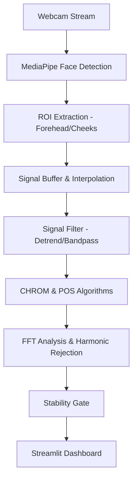

# 🫀 Advanced rPPG Heart Rate Monitor

**Real-time Remote Photoplethysmography (rPPG) System**

This system estimates heart rate (BPM) from a standard webcam stream by detecting subtle color changes in facial skin caused by the cardiac cycle (blood volume pulse). It features a robust signal processing pipeline designed to handle motion, uneven frame rates, and lighting fluctuations.

---

## 🚀 Recent Performance Breakthroughs
The system has been specifically optimized for accuracy with a **"High-Fidelity Accuracy Stack"**:
*   **Harmonic Rejection Logic**: Prevents the common "2x HR" error where the system locks onto the 2nd harmonic (e.g., showing 120 BPM instead of a real 60 BPM).
*   **Stability Gating**: Implements a "Stabilizing..." state where heart rate is only displayed if the variance over a 10-second window is low (< 5 BPM std dev).
*   **Timestamp Interpolation**: Re-samples irregular webcam frame arrivals onto a perfect temporal grid to eliminate spectral leakage in the FFT analysis.
*   **Motion Outlier Rejection**: Dynamically clamps RGB values that deviate significantly from the recent mean, suppressing noise from head movement.

---

## 🛠 Features
*   **Live Webcam Interface**: Streamlit-based UI with real-time face tracking and HR display.
*   **Dual-Algorithm Fusion**: Uses both **CHROM (Chromaticity-based)** and **POS (Plane-to-Orthogonal-to-Skin)** algorithms for cross-verified estimation.
*   **Advanced Landmarks**: MediaPipe FaceMesh for precise stable skin region (ROI) extraction (forehead and cheeks).
*   **Signal Quality Score**: A multi-factor confidence metric (0-100%) based on SNR, Motion, Stability, and Lighting.
*   **PDF/Session Summaries**: Deep analysis of heart rate variability and stability metrics after each measurement.

---

## 🏗 Project Architecture



### Backend Components (`/backend`)
- **`services/`**: Core logic for face detection, algorithms, and HR estimation.
- **`api/`**: FastAPI implementation for orchestration.
- **`utils/`**: Specialized helpers for FFT, smoothing, and motion tracking.

### Frontend (`/frontend`)
- **`app.py`**: Streamlit application managing the WebRTC stream and visualization metrics.

---

## 🚦 Getting Started

### Prerequisites
- Python 3.10+
- Webcam

### Installation
1.  **Clone the repository**:
    ```bash
    git clone [repository-url]
    cd rPPG
    ```
2.  **Install dependencies**:
    ```bash
    pip install -r requirements.txt
    ```

### Running the Application
1.  **Start the UI**:
    ```bash
    streamlit run frontend/app.py
    ```
2.  Open your browser to `http://localhost:8501`.
3.  Allow camera access and remain relatively still for the first 10-15 seconds while the system stabilizes.

---

## 📊 Evaluation & Testing
To verify the accuracy on pre-recorded video files, use the provided pipeline testing script:
```bash
python test_video_pipeline.py path/to/video.mp4
```

To run the internal unit test suite (33 tests):
```bash
pytest tests/
```

---

## 🔬 Scientific Core
The system relies on the **Central Limit Theorem** of rPPG by combining:
1.  **Detrending**: Removing low-frequency trends (breathing/head tilt).
2.  **Bandpass Filtering**: Restricting energy to the physiological human heart rate range (50-180 BPM).
3.  **Hamming Windowing**: Tapering signal edges to minimize frequency domain artifacts.
4.  **SNR Estimation**: Calculating the ratio of energy at the pulse frequency vs. background noise.
